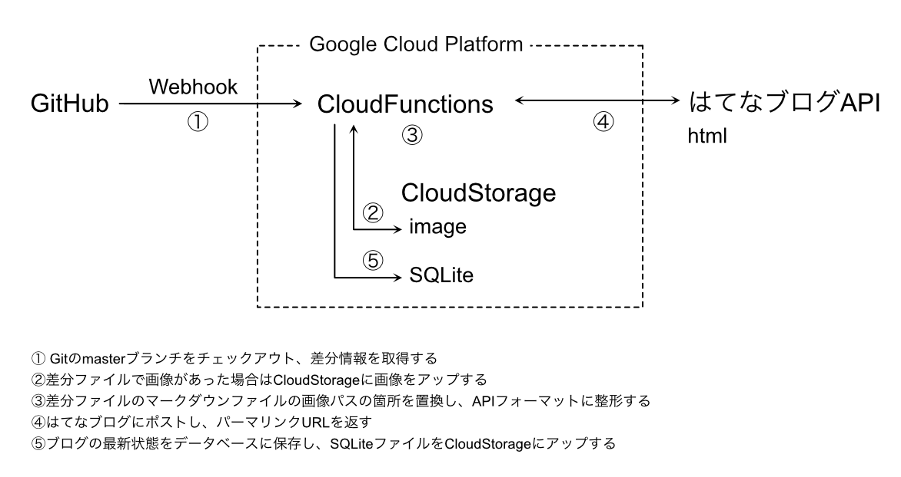

# Ledge Tech Blog AutoPost

## 概要

### システムの概要



- GitHubでmasterブランチへのプルリクエストが承認されたら、はてなブログに下書きとして投稿する
- 対象とするGitHubのリポジトリのURL、ブランチ名、はてなブログのブログIDはYAMLファイルで変更可能とする

### 動作環境

Google Cloud FunctionsのPython 3.7

#### 動作環境における制約

- Google Cloud Functionsではスクリプトを置いているディレクトリ内ではファイルの書き込みができないため、書き込むを行う際は標準ライブラリの`tmpfile`パッケージを使用する

### コーディングガイドライン

- [PEP8](https://pep8-ja.readthedocs.io/ja/latest/)に準拠する
- 参考）[\[Pythonコーディング規約\]PEP8を読み解く \- Qiita](https://qiita.com/simonritchie/items/bb06a7521ae6560738a7)

## 設定値

YAMLファイルで定義する

- GitHubのリポジトリのURL
- ブランチ名
- はてなブログのブログID
- SQLiteのGCS上のファイルパス（`gs://bucketname･･･`）

## データベース

### post（投稿）テーブル

|  物理名 | 論理名 | 型 | 説明文 | PK | EX |
| --- | --- | --- | --- | :---: | :---: |
|  entry_id | エントリーID | integer | はてなブログのエントリーID | ◯ |  |
|  hatena_url | URL | text | はてなブログのエントリーURL |  |  |
|  file_path | ファイルパス | text | Gitでのファイルパス |  |  |
|  user | ユーザー名 | text | ユーザー名 |  | ◯ |
|  created_at | 作成日 | text | レコードの作成日 |  |  |
|  update_at | 更新日 | text | レコードの更新日 |  |  |


## 関数一覧

### get_repository_diff_files

引数で指定したレポジトリをダウンロードし、指定したブランチと`draft`ブランチの差分を出力する。

#### 構文

```
get_repository_files(repository_url, local_path , [branch_name])
```

#### 引数

| 引数名 | 型 | I/O | 意味 |
|:--|:--|:--:|:--|
| repository_url | string | I | リポジトリのURL |
| local_path | object | I | ローカルのファイルオブジェクト |
| branch_name | string | I | ブランチ名 |

#### 戻り値

[差分サマリ型](#差分サマリ型)

### image_upload

差分ファイルの中から[画像ファイル](#画像ファイルの定義)をGCSにファイルをアップし、アップして公開される場合のURLを得る。

#### 構文

```
image_upload(image)
```

#### 引数

| 引数名 | 型 | I/O | 意味 |
|:--|:--|:--:|:--|
| image | object | I | imageファイルのPATH、change_type、rename_from・・・ |

#### 戻り値

[画像パス型](#画像パス型)

### get_md_contents

#### 概要

- 追加・修正したマークダウンファイルから記事内容を読み取り、記事内容を返す
- マークダウン内で指定した画像の中にGCSにアップした画像ファイルがあれば置換する

#### 構文

```
get_md_contents(image_uploads, markdown)
```

#### 引数

| 引数名 | 型 | I/O | 意味 |
|:--|:--|:--:|:--|
| image_uploads | object | I | GithubのイメージPATHとGCSのイメージPATH |
| markdown | object | I | 記事のタイトル名 |

#### マークダウンファイルのフォーマット

マークダウンファイルには本文の前にYAML形式でメタ情報を記入しているため、パースしてメタ情報としてフォーマットに変換する。

ファイル名： 任意
コンテンツ： 以下のフォーマットとする

```
---
blog_id: 名前_00X（名前_何番目の投稿なのかを数字で記載）
title: 「DevRel エンジニアフレンドリーになるための3C」の4章〜6章まで読んだ
category: Reading
user: なんでも
---

ここから本文

```


#### 戻り値

[ポスト型](#ポスト型)


### post_hatena

- はてなブログのAPIフォーマットに従い、引数の内容をはてなブログへPOSTし、記事URLを取得する
- 投稿に際しての認証情報、投稿先は設定値を参照する
- postの`change_type`の値で次のように動作する
	- `A`の場合、APIで記事内容を新規で追加し、取得したURLと記事IDを返す
	- `M`の場合、APIで記事を修正し、取得したURLと記事IDを返す
	- `D`の場合、APIで記事を削除し、`url`はnullを返す
	- `R`の場合、APIに投稿せず、`url`は`null`を返す

#### 構文

```
post_hatena(post)
```

#### 引数

| 引数名 | 型 | I/O | 意味 |
|:--|:--|:--:|:--|
| post | object | I | 記事内容 |

#### 戻り値

[投稿URL型](#投稿URL型)

### get_entry_id
- はてなブログAPI から特定記事のentry_idを取得

#### 構文

```
get_entry_id(hatena_id, blog_id, api_key):
```

#### 引数

| 引数名 | 型 | I/O | 意味 |
|:--|:--|:--:|:--|
| hatena_id | object | I | はてなID |
| blog_id | object | I | ブログID |
| api_key | object | I | apiキー |

#### 戻り値

| 項目 | 型 | 意味 |
|:--|:--|:--:|
| title_list | string | はてなブログ記事のタイトル目録 |
| entry_id_list | string | はてなブログ記事のエントリID |

----

## 用語

### <a name="画像ファイルの定義">画像ファイルの定義</a>

画像ファイルはファイルの拡張子が以下のものとする。

- `.jpg`
- `.jpeg`
- `.gif`
- `.png`
- `.svg`

### <a name="差分サマリ型">差分サマリ型</a>

```
[
  {
    "path": file_path,
    "change_type": change_type,
    "rename_from": rename_from
  },
  ･･･（以下略）･･･
]
```

| 項目 | 型 | 意味 |
|:--|:--|:--:|
| file_path | string | ファイルのパス |
| change_type | string | 変更の種類 |
| rename_from | string | リネーム前のパス |


### <a name="画像パス型">画像パス型</a>

```
[
  {
	  "local_path": local_path,
	  "remote_path": remote_path
  }
  ･･･（以下略）･･･
]
```

| 項目 | 型 | 意味 |
|:--|:--|:--|
| local_path | string | gitのファイルのパス |
| remote_path | string | GCSにアップしたファイルのパス |


### <a name="ポスト型">ポスト型</a>

```
[
  {
    "file": file_name,
    "change_type": change_type,
    "title": article_title,
    "category": category_name,
    "user": user,
    "text": body
  },
  ･･･（以下略）･･･
]
```

| 項目 | 型 | 意味 |
|:--|:--|:--|
| file | string | マークダウンのファイル名 |
| change_type | string | 変更の種類 |
| title | string | 記事タイトル |
| category | string | カテゴリー名 |
| user | string | ユーザー名 |
| body | string | マークダウン本文 |


>### <a name="投稿URL型">投稿URL型</a>

```
[
    {
        "blog_id": blog_id,
        "file": file,
        "change_type": change_type,
        "title": title,
        "category": category,
        "text": text,
        "url": url,
        "entry_id": entry_id
    }
]
```

| 項目 | 型 | 意味 |
|:--|:--|:--|
| blog_id | string | 記事のシリアルコード |
| file | string | ファイル名 |
| change_type | string | 変更の種類 |
| title | string | はてなブログのタイトル|
| category | string | 記事のカテゴリ |
| url | string | はてなブログのURL |
| entry_id | string | はてなブログの記事ID |


#### 変更の種類

変更の種類はそれぞれ次のように定義する

| 変更の種類名 | 意味 |
|:--:|:--|
| A | ファイルが追加された |
| D | ファイルが削除された |
| M | ファイルの内容が修正された |
| R | ファイル名がリネームされた |

#### リネーム前のパス

- リネーム前のパスは、change_typeが"R"の場合のみ値が入る
- それ以外の場合はNoneとする
- 値にはリネーム前のファイルパスが入る

## 設定ファイル

`config.yaml`に記載する。

| キー             | 意味                             |
|:----------------|:---------------------------------|
| git_url         | GitのリポジトリのURL               |
| git_branch_name | ブランチ名                        |
| hatena_blog_id  | はてなブログのID                   |
| api_key  | APIキー                   |
| blog_id  | ブログのURL                   |
| gs_path         | Google Cloud Storageのバケットパス |

## 開発環境の構築

1. `config.yml.template`から`config.yml`作成する
2. `poetry install` で必要パッケージをインストール
